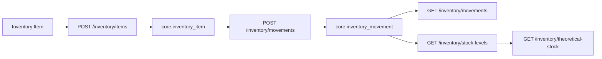

# BizTracker Current Status

Ez a dokumentum a projekt tenyleges jelenlegi allapotat foglalja ossze. Ha gyorsan at akarjuk latni, hol tartunk, mi mukodik mar, mi hianyzik meg, es mi legyen a kovetkezo implementacios fokusz, ezt a fajlt erdemes elolvasni eloszor.

Kapcsolodo dokumentumok:
- [PROJECT_DESCRIPTION.md](C:\BizTracker\PROJECT_DESCRIPTION.md)
- [ARCHITECTURE.md](C:\BizTracker\docs\ARCHITECTURE.md)
- [ACCOUNTING_AND_CONTROLLING_MODEL.md](C:\BizTracker\docs\ACCOUNTING_AND_CONTROLLING_MODEL.md)
- [BUSINESS_DIRECTION.md](C:\BizTracker\docs\BUSINESS_DIRECTION.md)
- [DATABASE_SYNC_NOTES.md](C:\BizTracker\docs\DATABASE_SYNC_NOTES.md)
- [DASHBOARD_DIRECTION.md](C:\BizTracker\docs\DASHBOARD_DIRECTION.md)
- [INVENTORY_DIRECTION.md](C:\BizTracker\docs\INVENTORY_DIRECTION.md)
- [THEORETICAL_STOCK_PREPARATION.md](C:\BizTracker\docs\THEORETICAL_STOCK_PREPARATION.md)
- [ROADMAP.md](C:\BizTracker\docs\ROADMAP.md)

## 1. Hol tartunk most

A projekt mar tul van a tiszta foundation fazison, es mar tobb valodi, vegponttol frontend oldalig lefuto MVP szelet mukodik:
- master data read
- import upload, parse, batch detail
- pos_sales import profil es finance mapping MVP
- finance read API es frontend oldal
- inventory item CRUD alap
- inventory movement write/read
- actual stock level read
- theoretical stock read readiness modell
- inventory frontend read es torzsadat kezelo oldalak
- procurement supplier foundation
- procurement purchase invoice foundation

Ez mar nem csak scaffold, hanem valodi, hasznalhato belso alkalmazas alap.

Uzleti szintu irany:
- a rendszer fo celja tovabbra is a `Gourmand` es a `Flow Music Club` uzleti elemzese
- az inventory, finance, import es kesobbi predikcio ezt tamogatja
- a jelenlegi pontositott uzleti iranyt a [BUSINESS_DIRECTION.md](C:\BizTracker\docs\BUSINESS_DIRECTION.md) rogziti

## 2. Ami mar mukodik

### Foundation
- FastAPI backend
- PostgreSQL adatbazis
- Alembic migration pipeline
- env alapu config
- SQLAlchemy 2 stilusu repository wiring
- React + TypeScript + Vite frontend
- TanStack Query alap

### Master data
- `GET /api/v1/master-data/business-units`
- `GET /api/v1/master-data/locations`
- `GET /api/v1/master-data/units-of-measure`
- `GET /api/v1/master-data/categories`
- `GET /api/v1/master-data/products`
- idempotens reference data bootstrap

### Imports
- `POST /api/v1/imports/files`
- `GET /api/v1/imports/batches`
- `POST /api/v1/imports/batches/{batch_id}/parse`
- `GET /api/v1/imports/batches/{batch_id}/rows`
- `GET /api/v1/imports/batches/{batch_id}/errors`
- fajlfeltoltes
- import batch es file metadata
- CSV technikai parsing
- staging sorok es parse hibak tarolasa
- `pos_sales` profil
- konnyu mezoszintu normalizalas

### Finance
- `POST /api/v1/imports/batches/{batch_id}/map/financial-transactions`
- `GET /api/v1/finance/transactions`
- `core.financial_transaction` tabla
- `pos_sales` import -> financial transaction mapping MVP
- egyszeru source reference alapu duplicate vedelem
- `Finance Transactions` frontend oldal

### Inventory backend
- `GET /api/v1/inventory/items`
- `POST /api/v1/inventory/items`
- `PATCH /api/v1/inventory/items/{item_id}`
- `DELETE /api/v1/inventory/items/{item_id}`
- `GET /api/v1/inventory/movements`
- `POST /api/v1/inventory/movements`
- `GET /api/v1/inventory/stock-levels`
- `GET /api/v1/inventory/theoretical-stock`
- inventory reference data bootstrap
- movement log
- actual stock level aggregacio movement log alapjan
- theoretical stock elso read modell explicit `not_configured` estimation basis jelolessel

### Inventory frontend
- `Dashboard` vizualis referenciaoldal
- `Inventory Overview`
- `Inventory Items`
- `Inventory Movements`
- `Stock Levels`
- `Theoretical Stock`
- inventory item create flow
- inventory item edit flow
- inventory item archive flow
- inventory movement create flow

### Procurement
- `GET /api/v1/procurement/suppliers`
- `POST /api/v1/procurement/suppliers`
- `GET /api/v1/procurement/purchase-invoices`
- `POST /api/v1/procurement/purchase-invoices`
- `POST /api/v1/procurement/purchase-invoices/{purchase_invoice_id}/post`
- `core.supplier` tabla
- `core.supplier_invoice`
- `core.supplier_invoice_line`
- supplier list es create backend flow
- manual purchase invoice list es create backend flow
- purchase invoice -> finance transaction posting flow
- purchase invoice line -> inventory purchase movement posting flow
- purchase invoice list posting status read model
- `Suppliers` frontend oldal
- `Purchase Invoices` frontend oldal
- `Purchase Invoices` frontend post action es status jelzes

### Analytics / Dashboard
- `GET /api/v1/analytics/dashboard`
- `GET /api/v1/analytics/dashboard/categories`
- `GET /api/v1/analytics/dashboard/products`
- `GET /api/v1/analytics/dashboard/expenses`
- scope-ok: `overall`, `flow`, `gourmand`
- idoszak presetek: `today`, `week`, `month`, `last_30_days`, `year`, `custom`
- KPI-k: revenue, cost, profit, transaction count
- revenue / cost / profit trend read model
- category breakdown POS import sorokbol
- top products POS import sorokbol
- expense breakdown finance actual outflow-kbol
- category -> product drill-down endpoint es frontend detail panel
- expense type -> transaction drill-down endpoint es frontend detail panel
- frontend dashboard sample helyett valodi business dashboard v1

### Frontend oldalak
- `Dashboard` valodi business dashboard v1
- `Master Data Viewer`
- `Finance Transactions`
- `Inventory Overview`
- `Inventory Items`
- `Inventory Movements`
- `Stock Levels`
- `Theoretical Stock`
- `Suppliers`
- `Purchase Invoices`
- `Import Center`

## 3. Jelenlegi inventory workflow



Jelenlegi jelentese:
- `Inventory Overview` = inventory landing es gyors operativ osszkep
- `Inventory Items` = torzsadat
- `Inventory Movements` = actual operational log
- `Stock Levels` = actual aggregated stock view
- `Theoretical Stock` = estimated reteg elso read-only readiness modellje

Uzleti ertelmezes:
- a jelenlegi inventory oldalcsalad az operativ es controlling alapot epiti
- a vegcel egy dashboard es drill-down alapu business analysis rendszer
- a jelenlegi UI mar tartalmaz egy kulon `Dashboard` vizualis referenciaoldalt is

Ez jo alap, de UI szinten meg kell erositeni az egyertelmu szerepkor-szetvalasztast. Ennek iranyat a [INVENTORY_DIRECTION.md](C:\BizTracker\docs\INVENTORY_DIRECTION.md) rogziti.

## 4. Jelenlegi API felulet

### Health
- `GET /api/v1/health`

### Master data
- `GET /api/v1/master-data/business-units`
- `GET /api/v1/master-data/locations`
- `GET /api/v1/master-data/units-of-measure`
- `GET /api/v1/master-data/categories`
- `GET /api/v1/master-data/products`

### Finance
- `GET /api/v1/finance/transactions`

### Inventory
- `GET /api/v1/inventory/theoretical-stock`
- `GET /api/v1/inventory/items`
- `POST /api/v1/inventory/items`
- `PATCH /api/v1/inventory/items/{item_id}`
- `DELETE /api/v1/inventory/items/{item_id}`
- `GET /api/v1/inventory/movements`
- `POST /api/v1/inventory/movements`
- `GET /api/v1/inventory/stock-levels`

### Imports
- `POST /api/v1/imports/files`
- `GET /api/v1/imports/batches`
- `POST /api/v1/imports/batches/{batch_id}/parse`
- `GET /api/v1/imports/batches/{batch_id}/rows`
- `GET /api/v1/imports/batches/{batch_id}/errors`
- `POST /api/v1/imports/batches/{batch_id}/map/financial-transactions`

### Procurement
- `GET /api/v1/procurement/suppliers`
- `POST /api/v1/procurement/suppliers`
- `GET /api/v1/procurement/purchase-invoices`
- `POST /api/v1/procurement/purchase-invoices`
- `POST /api/v1/procurement/purchase-invoices/{purchase_invoice_id}/post`

### Analytics
- `GET /api/v1/analytics/dashboard`
- `GET /api/v1/analytics/dashboard/categories`
- `GET /api/v1/analytics/dashboard/products`
- `GET /api/v1/analytics/dashboard/expenses`

## 5. Jelenlegi adatbazis allapot

Aktualis Alembic head:
- `015_inventory_movement_source_ref`

Fontos fejlesztoi megjegyzes:
- ezen a PC-n nincs local database
- a fo fejlesztoi gepen munkakezdeskor `alembic upgrade head` futtatasa szukseges
- az aktualis adatbazis-szinkron teendot a [DATABASE_SYNC_NOTES.md](C:\BizTracker\docs\DATABASE_SYNC_NOTES.md) rogziti

Schema-k:
- `auth`
- `core`
- `ingest`
- `analytics`

Fo tablak:
- `auth.user`
- `auth.role`
- `auth.permission`
- `auth.user_role`
- `auth.role_permission`
- `core.business_unit`
- `core.location`
- `core.unit_of_measure`
- `core.category`
- `core.product`
- `core.financial_transaction`
- `core.inventory_item`
- `core.inventory_movement`
- `core.supplier`
- `core.supplier_invoice`
- `core.supplier_invoice_line`
- `ingest.import_batch`
- `ingest.import_file`
- `ingest.import_row`
- `ingest.import_row_error`

## 6. Mi hianyzik meg

### Inventory
- movement create/edit UX finomitas
- theoretical / estimated stock valodi becslesi logikaja
- inventory valuation
- FIFO kompatibilis costing reteg

### Upload / procurement / source data
- PDF alapu szamla workflow
- manualis teteles beszerzes felvitel
- supplier invoice / purchase alap kesz
- purchase invoice -> inventory movement kapcsolat fo geps DB tesztelese
- purchase invoice -> finance cost kapcsolat fo geps DB tesztelese
- forgalmi CSV/Excel upload tovabbfejlesztese
- kesobbi POS API connector

### Dashboard / analytics direction
- `Overall` osszesito dashboard v1 elinditva
- kulon `Flow` business view v1 elinditva
- kulon `Gourmand` business view v1 elinditva
- interaktiv KPI, chart es drill-down workflow elokeszitve
- idojaras alapu elemzesi reteg elokeszitese

### Finance
- finance write workflow
- finance dashboard / KPI szint
- koltseg oldali strukturalt mapping

### Imports
- tovabbi import_type profilok
- procurement iranyu importok
- finomabb parse validacio

### Identity
- login
- token flow
- role based auth guardok

### Procurement / Production / Events
- procurement supplier es purchase invoice foundation utan mapping MVP
- recipe es production MVP
- events settlement MVP

### Analytics
- dashboard aggregatumok fo geps DB tesztelese
- actual vs estimated nezetek
- drill downos KPI workflow kovetkezo endpointjai

## 7. Nyitott iranydontesek

### Inventory menu es informacioarchitektura
Jelenleg van:
- `Inventory Overview`
- `Inventory Items`
- `Inventory Movements`
- `Stock Levels`
- `Theoretical Stock` backend read modell

Ez domain szinten jo iranyba rendezett, de UX szinten a kovetkezo korben tovabb kell tisztazni:
- actual es estimated inventory nezetek szeparalasat
- az overview oldalra epulo gyors navigaciot
- a movement create workflow helyet az inventory UX-ben

Ez nincs elsietve, de mar most tudatosan kell kezelni. A celirany a [INVENTORY_DIRECTION.md](C:\BizTracker\docs\INVENTORY_DIRECTION.md) szerint legyen.

### Theoretical / estimated stock
Mar van egy elso backend read modell, de ez meg tudatosan nem szamol estimated fogyast. A mostani szerepe:
- kulon read szerzodest adjon az estimated retegnek
- expliciten jelezze, hogy az estimation basis meg `not_configured`
- ne keverje ossze az actual es estimated mennyisegeket

A kovetkezo fazisban erre lehet raepiteni az elso valodi consumption / recipe alapu logikat. Az elokesziteset a [THEORETICAL_STOCK_PREPARATION.md](C:\BizTracker\docs\THEORETICAL_STOCK_PREPARATION.md) rogziti.

## 8. Javasolt kovetkezo fokusz

1. Procurement invoice -> inventory / finance mapping alap
2. Identity auth MVP
3. Inventory valuation es FIFO kompatibilis reteg elokeszitese
4. Overall / business dashboard kovetkezo valodi adatos szelete
5. Theoretical stock valodi becslesi alapjanak letetele

## 9. Gyors lokal futtatas

Backend:
```powershell
cd C:\BizTracker\backend
python -m uvicorn app.main:app --reload
```

Frontend:
```powershell
cd C:\BizTracker\frontend
npm.cmd run dev
```
