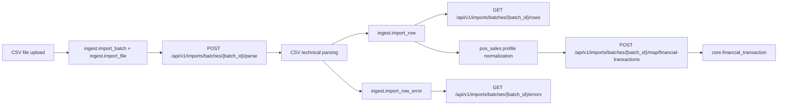

# BizTracker Current Status

Ez a dokumentum a projekt jelenlegi, valos allapotat foglalja ossze. Ha valaki gyorsan meg akarja erteni, hol tartunk most, mit tud mar a rendszer, es mi hianyzik meg, ezt a fajlt erdemes elolvasni eloszor.

Kapcsolodo dokumentumok:
- [PROJECT_DESCRIPTION.md](C:\BizTracker\PROJECT_DESCRIPTION.md)
- [ARCHITECTURE.md](C:\BizTracker\docs\ARCHITECTURE.md)
- [MVP_IMPLEMENTATION_PLAN.md](C:\BizTracker\docs\MVP_IMPLEMENTATION_PLAN.md)
- [MIGRATION_PLAN.md](C:\BizTracker\docs\MIGRATION_PLAN.md)
- [INITIAL_STRUCTURE.md](C:\BizTracker\docs\INITIAL_STRUCTURE.md)

## 1. Jelenlegi workflow



## 2. Ami mar mukodik

### Foundation
- FastAPI backend
- PostgreSQL adatbazis
- Alembic migration pipeline
- env-alapu config
- CORS fejlesztoi hasznalatra

### Master data
- `GET /api/v1/master-data/business-units`
- `GET /api/v1/master-data/locations`
- `GET /api/v1/master-data/units-of-measure`
- `GET /api/v1/master-data/categories`
- `GET /api/v1/master-data/products`
- idempotens reference data bootstrap

### Imports
- file upload
- import batch es file metadata tarolas
- CSV parse pipeline
- staging sorok tarolasa
- parse hibak tarolasa
- batch rows es errors detail endpointok
- `pos_sales` profil
- minimal mezoszintu normalizalas

### Finance
- `pos_sales` batch -> `financial_transaction` mapping MVP
- egyszeru source reference alapu duplicate vedes
- `core.financial_transaction` tabla

### Frontend
- `Master Data Viewer`
- `Import Center`
- batch lista
- batch reszletek
- parse inditas

## 3. Jelenlegi API felulet

- `GET /api/v1/health`
- `GET /api/v1/master-data/business-units`
- `GET /api/v1/master-data/locations`
- `GET /api/v1/master-data/units-of-measure`
- `GET /api/v1/master-data/categories`
- `GET /api/v1/master-data/products`
- `POST /api/v1/imports/files`
- `GET /api/v1/imports/batches`
- `POST /api/v1/imports/batches/{batch_id}/parse`
- `GET /api/v1/imports/batches/{batch_id}/rows`
- `GET /api/v1/imports/batches/{batch_id}/errors`
- `POST /api/v1/imports/batches/{batch_id}/map/financial-transactions`

## 4. Jelenlegi adatbazis allapot

Aktualis Alembic head:
- `007_core_financial_tx_base`

Eddig letrehozott schema-k:
- `auth`
- `core`
- `ingest`
- `analytics`

Kulcs taborok:
- `auth.user`
- `auth.role`
- `auth.permission`
- `auth.user_role`
- `auth.role_permission`
- `core.business_unit`
- `core.location`
- `core.unit_of_measure`
- `core.category`
- `core.product`
- `core.financial_transaction`
- `ingest.import_batch`
- `ingest.import_file`
- `ingest.import_row`
- `ingest.import_row_error`

## 5. Mi hianyzik meg

- identity login / token flow
- role-based auth guardok az API-n
- finance read endpointok es frontend oldalak
- inventory operativ flow
- procurement flow
- production flow
- events flow
- analytics dashboardok es aggregatumok
- import_type-specifikus tovabbi profilok

## 6. Javasolt kovetkezo lepesek

1. identity auth MVP
2. finance read API
3. inventory MVP
4. procurement MVP
5. analytics dashboard alapok

## 7. Gyors lokal futtatas

Backend:
```powershell
cd C:\BizTracker\backend
python -m uvicorn app.main:app --reload
```

Frontend:
```powershell
cd C:\BizTracker\frontend
npm.cmd run dev
```

